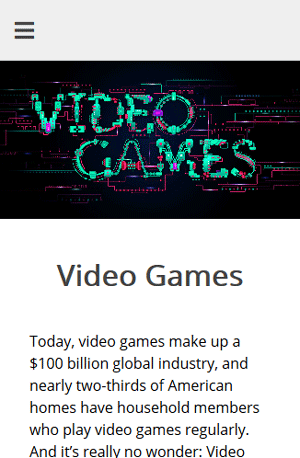

# Gaming Info

##Description

This website was the final project for the introductoryweb development course that I took in Spring of 2018 in Lehman College. The purpose of the project was to put everything we had learn throughtout the entire semester together in one page. The first version of the website I made had more color and more text which is the reason I decided to update it and make it more simple and streamlined. This version is more white and simple and the amount of text was reduced to improve readibility and avoid being boring. In addition, I applied some of the things I learned during the summer which includes jQuery and JavaScript. Some simple scripts were added to make the website more interactive and "alive."

##The Website

The website can be previewed by following this link: https://goo.gl/fQ7Xy9

Please report any issue that you encounter while viewing the website.
